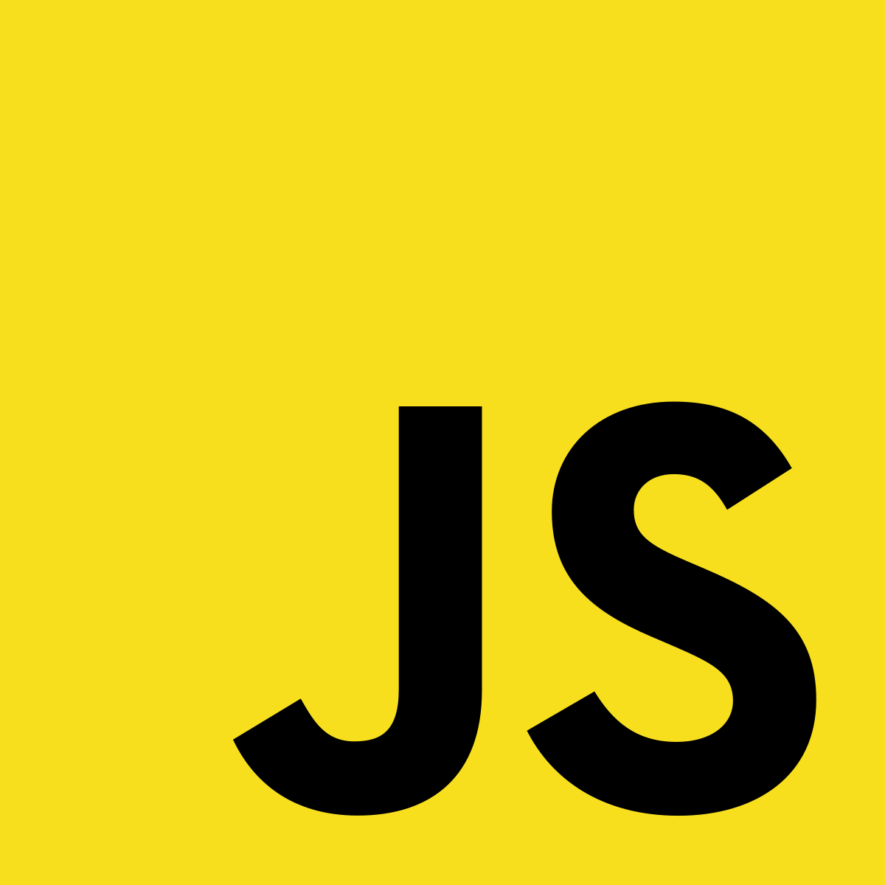

<p align="center">
 
<a href="https://twitter.com/elbkrrr">
 
 
 
 </a>

<a href="https://discord.com/users/521311050193436682">
 
 
 
 </a>
   
 <a href="mailto:noocambiar@gmail.com">
 
 
 
 </a>
 
 <a href="https://open.spotify.com/user/6pvuvgli1so4llgc66dxjcdkd?si=0870274e1e2b4a30">
 
 
 
 </a>
   
</p>
<p align="center">

 </p>

```js
<This is an introduction>
 NOT developing The Bro Bots, two Discord bots
 Currently learning react ☣️
```
<details align="left">
  <summary>:star: GitHub Stats</summary>
   
</details> 

### Languages and Tools:

<a href="https://code.visualstudio.com"></a>
<a href="https://discord.js.org"></a>
<a href="https://developer.mozilla.org/es/docs/Web/JavaScript"></a>
<a href="https://reactjs.org"></a>
<a href="https://nodejs.org/"></a>
<a href="https://www.mongodb.com"></a>
<a href="https://www.npmjs.com"></a>
<a href="https://developer.mozilla.org/es/docs/Web/CSS"></a> <br />

---
<p align="center">

<a href="https://discord.gg/uA2Epyg8uR">

   

   </a>
</p>


