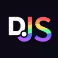

<p align="right">

</p>
<p align="center">
 
<a href="https://twitter.com/elbkrrr">
 
 
 
 </a>

<a href="https://discord.com/users/521311050193436682">
 
 
 
 </a>
   
 <a href="mailto:zaakoukiayman@gmail.com">
 
 
 
 </a>
 
 <a href="https://fiverr.com/elbkrr">
 
 
 
 </a>
   
</p>
<p align="center">

 </p>

 <p align ="center">
   <a href="https://www.jetbrains.com/community/opensource/#support">
    
  </a>  Thanks to <a href="https://www.jetbrains.com/community/opensource/#support">JetBrains</a> for providing me free license for developing my projects!
  </p>
  
```js
<This is an introduction>
 NOT developing The Bro Bots, two Discord bots
 Currently learning react ☣️
```

### Languages and Tools:

<a href="https://discord.js.org"></a>
<a href="https://developer.mozilla.org/es/docs/Web/JavaScript"></a>
<a href="https://reactjs.org"></a>
<a href="https://nodejs.org/"></a>
<a href="https://www.mongodb.com"></a>
<a href="https://www.npmjs.com"></a>
<a href="https://developer.mozilla.org/es/docs/Web/CSS"></a>
<a href="https://www.jetbrains.com"></a> <br />

---
<p align="center">

<a href="https://discord.gg/uA2Epyg8uR">

   

   </a>
</p>

<details align="left">
  <summary>:star: GitHub Stats</summary>
   
</details> 
